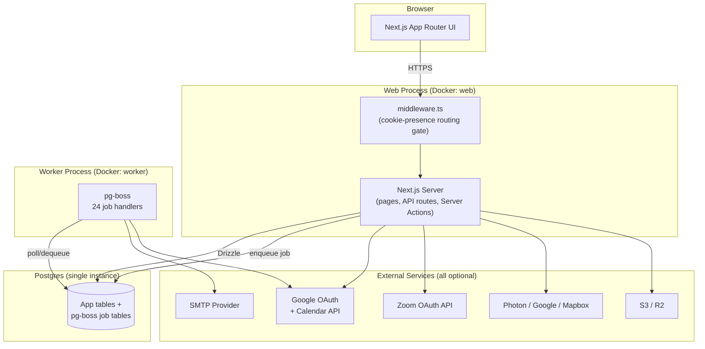
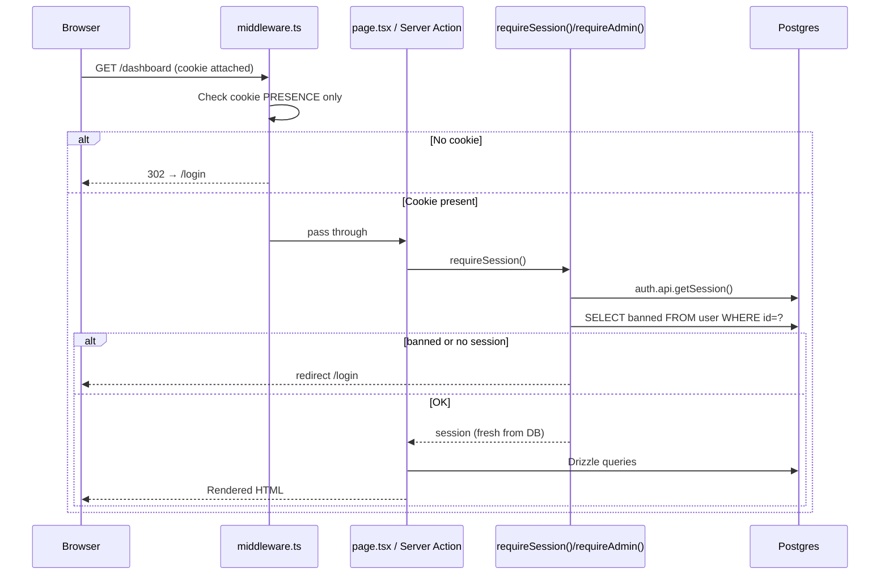
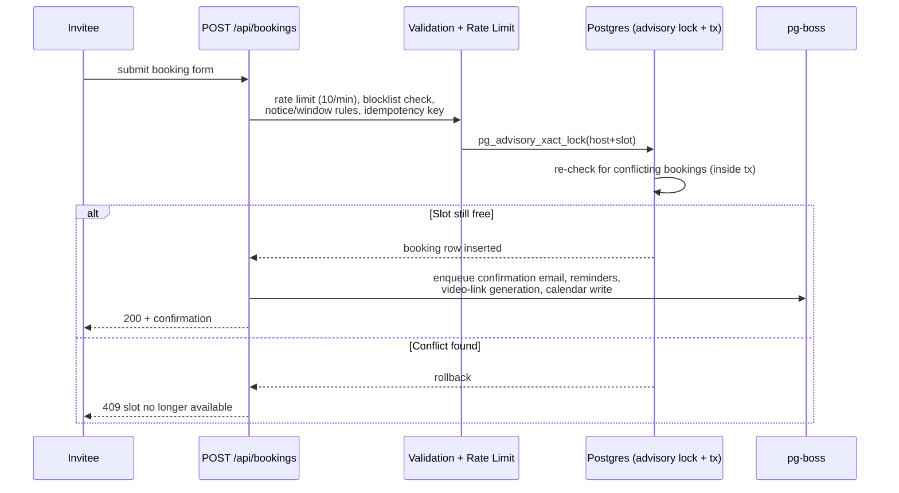

# Schduled — Project Review

**Reviewed:** `main` branch, commit `e579a93` (merge of PR #53, "setup-wizard-and-account-settings")
**Method:** Static analysis of the current codebase only. No code was modified to produce this document. Where something could not be confirmed in the code, it is explicitly marked **Not Implemented** or **Not observed** rather than assumed.

---

## 1. Executive Summary

**Project purpose:** Schduled is a self-hostable scheduling/booking platform (a Calendly/Cal.com-style product) — hosts define "event types" (meeting templates), set their availability, and share a public booking link. Invitees pick a time, the system generates a video link (Zoom/Google Meet) or in-person location, syncs to the host's Google Calendar, and sends confirmation/reminder emails, all without back-and-forth.

**Primary features:** Event types with custom durations/questions/policies; weekly + date-override availability with holiday awareness and global meeting caps; a public booking flow with real-time slot computation and Postgres-advisory-lock-guarded conflict prevention; booking approval workflow; self-service cancellation/rescheduling via tokenized links; Google Calendar two-way sync; Zoom/Google Meet video link generation; a durable email outbox with delivery-webhook tracking; booking reminders and follow-ups via a pg-boss job queue; a contacts/CRM view; an internal "Orbit" admin panel (users, audit log, email visibility, queue monitor, platform settings); a first-run setup wizard; and self-service password/appearance management for both admins and regular users.

**Current development status:** Actively developed, pre-1.0, no tagged releases yet (`CHANGELOG.md` keeps everything under `[Unreleased]`, explicitly stating semantic versioning starts once the "OSS release process" in `SELF-HOSTING.md` Phase 3 completes). The schema has 15 migrations, all small and additive — a healthy, low-risk incremental evolution pattern with no destructive changes observed. The most recently merged feature (this review's own trigger) added a self-hosting-oriented first-run setup wizard, password management, and an MIT `LICENSE`.

**Technology stack:** Next.js 16 (App Router, Turbopack), TypeScript 6 (strict), PostgreSQL + Drizzle ORM, Better Auth 1.6.18, Tailwind v4 + shadcn/Radix (Phosphor icons), pg-boss (Postgres-native job queue), nodemailer + react-email, optional S3/R2 file storage, Docker Compose deployment. Full detail in §3.

**Overall architecture:** Three independently deployable processes sharing one Postgres database: a Next.js web server (UI + API routes + Server Actions), a separate pg-boss worker process (email delivery, reminders, calendar sync), and Postgres itself. No Redis, no message broker, no external cache — Postgres is the single source of truth and the job queue backend, which keeps the operational surface area small for a self-hosted product.

**Estimated production readiness: ~62/100.** The application layer (auth, booking logic, admin tooling, security headers, rate limiting, audit logging) is unusually mature and well-considered for a project with no tagged release. What's missing is entirely in the *operational safety net*: there is no automated test suite of any kind, no error-tracking/APM integration, no structured logging, and the rate limiter is explicitly single-instance-only. These are exactly the gaps that turn "works great in the demo" into "3am incident with no visibility" at real scale — see §16 and §29 for the full reasoning.

**Biggest strengths:**
- Security-conscious defaults: full CSP/HSTS/frame-ancestors header set, fail-fast Zod env validation, live ban re-verification on every request (not just at session creation), admin self-protection (can't ban/demote another admin, can't ban self), audit logging with 30 distinct action types.
- Concurrency-safe booking core: Postgres advisory locks + transactional re-checks on create/approve/reschedule prevent double-booking races — a detail many booking apps get wrong.
- Exceptionally clean TypeScript discipline: `strict: true`, and only 3 total `any`/`ts-ignore` occurrences across ~355 files, all narrowly justified.
- Coherent, already-implemented password/appearance self-service (the very feature this review's source PR added) — dynamically adapts UI based on actual account/environment state rather than hardcoding assumptions.

**Biggest weaknesses:**
- **Zero automated tests.** No unit, integration, or E2E suite exists; CI verifies only typecheck + migration + build success.
- **No error tracking, no structured logging.** Production issues are only visible via `console.*` output that someone has to be tailing.
- **In-memory-only rate limiting**, explicitly documented in code as unsuitable for multi-instance deployment — a real correctness gap the moment this scales past one web replica.
- Two Orbit admin list pages (`users`, `audit`) run **unbounded/paginate-client-side** queries against tables (users, audit log) that are expected to grow indefinitely, inconsistent with the correctly-implemented server-side pagination already used on the main Bookings page.

---

## 2. Project Structure

```
app/
├── api/                    # REST-style API routes (see §6, §8)
├── actions/                 # Server Actions — mutations not exposed as HTTP routes (§6)
├── (app)/                   # Authenticated core product: dashboard, bookings, event-types,
│                             #   availability, contacts, profile, settings
├── (auth)/                   # /login, /reset-password
├── (booking)/                # Public invitee-facing flow: [username]/[eventSlug], cancel,
│                             #   reschedule, confirmed, booking/review
├── (landing)/                # Public marketing + legal: /, about, contact, privacy, terms, cookies
├── (onboarding)/              # Post-signup onboarding wizard
├── (orbit)/                   # Authenticated + role-gated admin panel ("Orbit")
├── (orbit-public)/             # Orbit's own login page (outside the authenticated group)
├── setup/                    # First-run setup wizard (only reachable pre-first-user)
└── post-auth/                 # Role-agnostic post-login redirect target

components/
├── ui/                      # 39 shadcn-style primitives (Radix-based, no radius/shadow per design.md)
├── admin/, orbit/            # Admin-panel-specific components
├── profile/                  # Shared profile components (incl. password-card.tsx, sessions-card.tsx)
├── scaffold/                 # App shell: sidebar, header, page-header, impersonation banner
├── onboarding/, landing/, common/, tour/

lib/
├── auth.ts, authz.ts, auth-client.ts, auth-password.ts, auth-errors.ts   # Auth config + guards
├── db.ts                    # Drizzle + postgres.js client
├── email/, smtp/             # Outbox pattern + SMTP transport + react-email templates
├── worker/                   # pg-boss setup + 24 job handlers
├── calendar/                 # Slot computation, conflict validation, Google Calendar logic
├── zoom/                     # Zoom OAuth client
├── storage/, s3.ts            # Pluggable local-disk / S3 file storage
├── settings/                  # Platform-wide admin settings (sign-in methods)
├── validators.ts, env.ts, utils.ts, audit.ts, api/helpers.ts (rate limiting)

db/
├── schema/                   # 17 files, one per domain (see §7)
├── migrations/                # 15 SQL migrations + Drizzle snapshots
└── reset.ts                  # Dev-only destructive reset script

config/          — app-wide constants (product name, ADMIN_ROLE/USER_ROLE)
scripts/         — dev-db.ts (embedded Postgres), make-admin.ts, worker.ts entrypoint
docs/            — architecture, DB schema, feature specs, self-hosting guide set, bug reports
public/          — static assets + local-disk upload target
hooks/           — one custom hook (use-username-check.ts)
```

**Two stray/cleanup items noted during this review** (not risky, just clutter):
- `docs-1/` — a second, oddly-named docs folder containing a single `commands.md` cheat-sheet; looks like an accidental duplicate that should be merged into `docs/` or removed.
- `__MACOSX/` — a macOS zip-extraction junk directory, not git-tracked, but physically present on disk; safe to delete.

---

## 3. Tech Stack

| Category | Technology | Version |
|---|---|---|
| Framework | Next.js (App Router, Turbopack dev server) | `16.2.9` |
| Runtime | Node.js | `22` |
| Language | TypeScript (`strict: true`) | `^6.0.3` |
| Database | PostgreSQL | `16` (Docker image) |
| ORM | Drizzle ORM + drizzle-kit | `^0.45.2` / `^0.31.10` |
| Auth | Better Auth (email+password, magic link, Google OAuth, admin/impersonation plugin) | `^1.6.18` |
| UI library | shadcn-style components over `radix-ui` | `radix-ui ^1.5.0`, `shadcn` CLI `^4.11.0` |
| State management | None (plain React state + 2 Contexts; no Redux/Zustand/Jotai) | — |
| Styling | Tailwind CSS | `^4.3.1` |
| Package manager | pnpm (single workspace) | `pnpm@11.6.0` |
| Background jobs | pg-boss (Postgres-native queue, separate worker process) | `^12.19.1` |
| File storage | Local disk (default) or S3/R2 via `@aws-sdk/client-s3` | `^3.1068.0` |
| Email | nodemailer (SMTP) + react-email templates | `nodemailer ^8.0.11`, `react-email ^6.6.0` |
| Analytics | **Not Implemented** | — |
| Logging | **Not Implemented (structured)** — plain `console.*` throughout | — |
| Testing | **Not Implemented** — no framework installed | — |
| CI/CD | GitHub Actions (`ci.yml`) — typecheck, migrate, build; no deploy step | — |
| Deployment | Docker Compose (self-hosted) — separate `web`/`worker`/`postgres` services; no managed-platform-specific config found | — (full detail in §18) |
| Payments | **Not Implemented** — no Stripe/billing integration, no subscription tables | — |

**Other notable dependencies:** `zod ^4.4.3` (env validation), `react-hook-form ^7.79.0`, `@dnd-kit/*` (drag-and-drop reordering), `googleapis ^173.0.0`, `date-fns`/`date-fns-tz`/`date-holidays`/`countries-and-timezones` (scheduling/timezone logic), `ical-generator ^11.0.0`, `sharp ^0.35.1` (avatar processing), `next-themes ^0.4.6`, `@biomejs/biome 2.5.0` (lint/format — **no ESLint**, Biome fully replaces it).

---

## 4. Application Architecture

### High-level architecture



### Request lifecycle (authenticated app route)



Note the deliberate split: **middleware only checks cookie presence** (it cannot decode role/ban status from the token), while **`requireSession()`/`requireAdmin()` re-verify ban status and role against the database on every single call** — a defense-in-depth pattern explicitly commented in the code because Better Auth itself only enforces bans at session *creation* time.

### Public booking creation flow



### Client flow
The browser talks to the Next.js server over standard HTTPS requests — full page navigations and Server Actions for authenticated app pages (progressive enhancement via `<form action={...}>` and `useTransition`), and plain `fetch()` calls from client components to the small number of routes that need client-side interactivity (e.g. slot-picker calls to `/api/slots`, `/api/available-days`). There is no separate SPA data-fetching layer (no React Query/SWR/Apollo) — client components that need server data receive it as server-rendered props from their parent page, or call the App Router's API routes directly.

### Server flow
Server components (≈70% of `.tsx` files, see §13) fetch data directly via Drizzle inside `page.tsx`/`layout.tsx`, with no intermediate API hop — a request for `/dashboard` runs its Drizzle queries in the same process/request as the page render. Mutations go through Server Actions (`app/actions/*.ts`) called directly from client components via `<form action>` or programmatic calls, rather than through a REST API layer, except where a route needs to be reachable by an external caller (webhooks, OAuth callbacks, public unauthenticated endpoints) — those live under `app/api/`.

### API flow
See the sequence diagram above for the public booking-creation path, and the full endpoint table in §8. In general: `app/api/**/route.ts` handlers are used for (a) endpoints that must be callable without a browser session (public booking flow, webhooks, OAuth callbacks), and (b) small polling/lookup endpoints called from client components. Everything else (settings, event-type CRUD, admin actions) goes through Server Actions instead of a route handler.

### Database interactions
All access goes through Drizzle ORM's query builder or tagged-template `sql` fragments (confirmed parameterized, no raw string concatenation of user input anywhere — see §14, SQL Injection finding). One Postgres instance serves both the application tables and the pg-boss job-queue tables, avoiding a separate broker dependency.

### External services
All are optional and independently feature-flagged via environment variables: SMTP (email delivery — falls back to console logging), Google OAuth (login + Calendar sync), Zoom OAuth (video links), a geocoding provider chain (Photon/OSM keyless default, or Google/Mapbox), and S3/R2 (file storage, falls back to local disk).

### Authentication flow
See §9 for full detail. Summary: Better Auth handles email+password, magic link, and Google OAuth uniformly through one `databaseHooks.user.create` gate that enforces `SIGNUP_ENABLED`/`INITIAL_ADMIN_EMAIL` bootstrap logic regardless of which method was used.

### Authorization flow
Binary role model (`user`/`admin`, `config/platform.ts`). No granular permissions system. Admin routes are gated twice: coarsely by middleware (cookie presence), then authoritatively by `requireAdmin()` (DB-fresh role + ban check) inside the Orbit layout.

### File upload flow
`POST /api/upload/avatar` → MIME/size validation (5 MB max) → `sharp` resize to 256×256 WebP → pluggable storage driver (`lib/storage/local.ts` or `lib/storage/s3.ts`) → URL saved to `user.image`.

### Payment flow
**Not Implemented.** No payment/billing integration exists anywhere in the codebase (no Stripe, no billing tables, no subscription logic).

---

## 5. Feature Inventory

| Feature | Purpose | Status | Key files | Dependencies | API endpoints | Tables | Known limitations |
|---|---|---|---|---|---|---|---|
| Event types | Reusable bookable meeting templates (name, durations, location, policies, custom questions) | Complete | `app/actions/event-types.ts`, `app/(app)/event-types/**` | Drizzle, `@dnd-kit/*` (reorder) | `/api/slug-check` | `event_type`, `event_type_duration`, `event_type_question`, `cancellation_policy` | — |
| Availability & scheduling rules | Weekly hours, date overrides, holiday awareness, global meeting caps | Complete | `app/actions/availability.ts`, `lib/calendar/slots.ts` | `date-holidays`, `date-fns-tz` | `/api/holidays` | `availability_schedule`, `availability_window`, `availability_override`, `meeting_limit` | Holiday picker's auto-block-vs-informational behavior not fully confirmed from code alone — verify in UI before relying on it |
| Public booking flow | Invitee-facing slot picker + booking submission | Complete, concurrency-safe | `app/api/bookings/route.ts`, `lib/calendar/validate-slot.ts` | Postgres advisory locks | `/api/bookings`, `/api/slots`, `/api/available-days` | `booking` | — |
| Booking approval workflow | Optional host approve/decline step before a booking is confirmed | Complete | `app/api/bookings/{approve,reject}/route.ts` | Email outbox (approval-request email) | `/api/bookings/approve`, `/api/bookings/reject` | `booking` (status/token columns) | — |
| Rescheduling | Token-based self-service reschedule with re-validated policy | Complete | `app/api/bookings/reschedule/route.ts` | Same slot/conflict logic as booking creation | `/api/bookings/reschedule` | `booking` | — |
| Cancellation | Token-based self-service cancellation with policy enforcement | Complete | `app/api/bookings/cancel/route.ts` | — | `/api/bookings/cancel` | `booking` | — |
| Google Calendar sync | Two-way calendar sync for conflict-checking and writing bookings | Mostly complete | `app/api/integrations/google/**`, `lib/worker/handlers/calendar-*.ts` | `googleapis`, `ENCRYPT_KEY` | `/api/integrations/google`, `/api/integrations/google/callback` | `connected_calendar`, `calendar_event_cache` | Explicit `// TODO (Step 21)` — disconnect-alert email not yet sent, only logged |
| Video links (Zoom / Google Meet) | Auto-generated video links for video-type bookings | Complete (Zoom + Meet) | `app/api/integrations/zoom/**`, `lib/worker/handlers/video-link-generate.ts` | `lib/zoom/client.ts`, `ENCRYPT_KEY` | `/api/integrations/zoom`, `/api/integrations/zoom/callback` | `video_connection` | Microsoft Teams is a UI label only — no working OAuth/connection flow exists |
| Email notifications | Transactional email (confirmation, approval, cancellation, reschedule) | Complete | `lib/email.ts`, `lib/worker/handlers/email-*.ts` | `nodemailer`, `react-email`, pg-boss | `/api/webhooks/email` (inbound delivery events) | `email_outbox`, `email_events`, `notification_preference` | — |
| Booking reminders/follow-up | 24h/1h pre-meeting reminders + post-meeting follow-up | Complete | `lib/worker/handlers/booking-reminder.ts` | pg-boss (`singletonKey`/`startAfter`) | — (background job, no direct endpoint) | `workflow_job` | — |
| In-app notifications | Bell-icon notification center | Complete | `app/api/notifications/**` | — | `/api/notifications`, `/api/notifications/[id]`, `/api/notifications/read` | `notification` | — |
| Contacts / CRM | Auto-populated contact records from bookings | Complete | `app/actions/settings.ts`, `app/(app)/contacts/**` | — | `/api/contact-lookup` | `contact` | — |
| Admin user management | Search/ban/delete users, per-user detail view | Complete | `app/actions/orbit-users.ts` | `requireAdmin()` | — (Server Actions, no route) | `user` + joins | Users list page runs an unbounded query, paginates client-side (see §13, §15) |
| Admin audit log | System-wide append-only security/action log | Complete | `lib/audit.ts` | — | — | `audit_logs` | Capped at most-recent 500 rows server-side with no further server pagination |
| Admin email visibility | Outbox monitor + provider delivery events | Complete | `app/(orbit)/orbit/email/page.tsx` | — | — | `email_outbox`, `email_events` | — |
| Admin queue monitoring | pg-boss job state monitor + retry | Complete | `lib/worker/queue-inspection.ts` | pg-boss | — (Server Actions) | pg-boss internal tables | — |
| Onboarding wizard | Guided first-login flow (profile → username → timezone → availability → calendar) | Complete | `app/actions/onboarding.ts` | — | — | `user.onboarding_step/onboarding_done` | — |
| First-run setup wizard | One-time first-admin creation when the instance has zero users | Complete | `app/actions/setup.ts`, `lib/setup.ts` | Better Auth `signUpEmail` | — (Server Action) | `user` | A documented, since-fixed race condition existed in first-admin creation (`docs/bugs/2026-07-14-*first-admin-race-condition*`) |
| Profile / security settings | Name/email/avatar, sessions, blocklist | Complete | `app/actions/profile.ts`, `app/actions/security.ts` | — | `/api/account/export`, `/api/upload/avatar` | — | — |
| Password management (set/change) | Add/change a password for magic-link/Google-only or existing accounts | Complete | `components/profile/password-card.tsx`, `lib/auth-password.ts` | Better Auth `setPassword`/`changePassword` | — (Server Action + Better Auth client call) | `account.password` | — |
| Appearance settings | Light/Dark/System theme picker (admin + setup wizard) | Complete | Orbit `appearance-card.tsx`, `next-themes` | `next-themes` | — | — | — |
| Cookie consent | Legal policy page + in-app preference panel | Complete (info + preferences, not a full CMP) | `app/(landing)/cookies/page.tsx` | — | — | — | No consent-log/audit trail — just a preference panel |
| Newsletter / subscribers | Public footer email capture + admin viewing | Complete but minimal | `app/api/newsletter/route.ts` | — | `/api/newsletter` | `newsletter_subscriber` | No unsubscribe-link/sending pipeline — capture + admin viewing only |
| Holiday-aware availability | Country-based public holiday lookup | Complete (display) | `lib/holidays.ts` | `date-holidays` | `/api/holidays` | — | Auto-block vs. informational-only behavior unclear from code alone |
| Address geocoding | Autocomplete for in-person meeting locations | Complete | `app/api/geocode/route.ts` | Photon/Google/Mapbox (pluggable) | `/api/geocode` | — | Gracefully degrades to plain text on failure |
| Avatar upload | Profile photo upload/resize/store | Complete | `app/api/upload/avatar/route.ts` | `sharp` | `/api/upload/avatar` | — | — |
| Data export | Self-service JSON export of the user's own data | Complete | `app/api/account/export/route.ts` | — | `/api/account/export` | — | — |
| Account deletion | Emailed-confirmation-code account deletion | Complete | `app/actions/profile.ts` | Email outbox | — (Server Action) | — | — |
| Booking blocklist | Per-host email/domain block rules | Complete | — | — | `/api/check-blocked` | `booking_blocklist` | No index on `user_id` — hot-path table (see §7) |
| Rate limiting / idempotency | Abuse throttling + duplicate-submission prevention | Complete but single-instance | `lib/api/helpers.ts` | In-memory `Map` store | Applied across most public routes (see §8) | `idempotency_key` | **In-memory only** — explicitly documented as unsuitable beyond one web replica |
| Sign-in method toggles | Admin-configurable platform-wide auth method availability | Complete | `lib/settings/sign-in-methods.ts` | — | — (Server Action) | `app_setting` | — |

---

## 6. Routing

### Pages (grouped by route group)

**`(app)` — authenticated core product:** `/dashboard`, `/dashboard/profile` (legacy redirect stub), `/event-types`, `/event-types/new`, `/event-types/[id]`, `/availability`, `/bookings`, `/bookings/[id]`, `/contacts`, `/profile/profile`, `/profile/security`, `/profile/login`, `/settings/my-link`, `/settings/calendars`, `/settings/integrations`, `/settings/communication`, `/settings/contacts`, `/settings/cookies`.

**`(auth)`:** `/login`, `/reset-password`.

**`(booking)` — public:** `/[username]`, `/[username]/[eventSlug]`, `/cancel/[token]`, `/reschedule/[token]`, `/confirmed`, `/booking/review/[token]`.

**`(landing)` — public:** `/`, `/about`, `/contact`, `/privacy`, `/terms`, `/cookies`.

**`(onboarding)`:** `/onboarding`.

**`(orbit)` — authenticated + admin-role-gated:** `/orbit`, `/orbit/users`, `/orbit/users/[id]`, `/orbit/audit`, `/orbit/email`, `/orbit/queues`, `/orbit/subscribers`, `/orbit/settings`.

**`(orbit-public)`:** `/orbit/login`.

**Standalone:** `/setup` (pre-first-user only), `/post-auth` (role-agnostic post-login redirect).

### API routes
See the full table in §8 — 29 `route.ts` files under `app/api/` (27 distinct endpoints; the Google and Zoom integrations each pair a start route with a separate OAuth callback route).

### Middleware
`middleware.ts` classifies every request into: always-public prefixes (Better Auth handler, admin OAuth callback, static assets, public cancel/reschedule links), protected prefixes (redirect to `/login` if no session cookie), and admin prefixes (redirect to `/orbit/login` if no session cookie). **It checks cookie presence only** — full session/ban/role validation is deferred to `requireSession()`/`requireAdmin()` downstream. Full detail and rationale in §4 and §9.

### Protected vs. public routes summary
- **Public:** landing/legal pages, public booking flow, `/login`, `/orbit/login`, `/setup` (until first user exists), all token-based booking actions (cancel/reschedule links).
- **Protected (any authenticated user):** `/dashboard`, `/event-types*`, `/availability`, `/bookings*`, `/settings*`, `/profile*`, `/onboarding`, `/post-auth`.
- **Admin-only:** everything under `/orbit` except `/orbit/login`.

---

## 7. Database

**Type:** PostgreSQL 16, accessed via Drizzle ORM (`postgres.js` driver).

### Schema overview
33 tables across 12 domain files under `db/schema/` (`auth`, `event-types`, `bookings`, `availability`, `contacts`, `calendars`, `profile`, `notifications`, `audit-logs`, `email-outbox`, `email-events`, `job-logs`, `platform`, `security`, `video`), plus a shared `enums.ts` and `relations.ts`. The schema is organized one-file-per-domain rather than one giant file, and IDs are `text` cuid2 values throughout (not serial/UUID) generated via `@paralleldrive/cuid2`. Every table has `created_at`/`updated_at` timestamptz columns with `defaultNow()` where mutation tracking matters.

### Tables (grouped by domain)

**Auth (Better Auth core):** `user` (role, banned/banReason/banExpires, username, timezone, onboarding progress — indexed on email, username), `session` (token, impersonatedBy — **no index on user_id**), `account` (OAuth + hashed password in one table — **no index on user_id**), `verification` (OTP/email tokens — no indexes).

**Scheduling core:** `event_type` (unique on user_id+slug, indexed on user_id+is_active), `event_type_duration` (no index on event_type_id), `cancellation_policy` (1:1, unique on event_type_id), `event_type_question` (no index on event_type_id).

**Bookings:** `booking` (well-indexed: host+start, host+status, invitee_email, cancel/reschedule/approval tokens — `rescheduled_from_id` is a **logical, unenforced FK**), `booking_answer` (no index), `booking_guest` (no index).

**Availability:** `availability_schedule` (no index on user_id), `availability_window` (no index on schedule_id), `availability_override` (indexed user_id+date), `meeting_limit` (no index on user_id).

**Contacts:** `contact` (indexed on host_user_id, unique host_user_id+email).

**Calendars:** `connected_calendar` (indexed user_id+provider, status, and a partial unique index enforcing at most one write-target calendar per user), `calendar_event_cache` (indexed, unique per external event — **no TTL/pruning column**).

**Profile:** `user_profile` (1:1, theme/date-format/time-format prefs), `user_branding` (1:1, white-label colors), `username_redirect` (**no index on old_username**, the column it's actually looked up by).

**Notifications:** `notification_preference` (1:1), `notification` (indexed user_id, user_id+read_at), `workflow_job` (indexed booking_id/singleton_key/status individually — **no composite (status, scheduled_for) index**, the shape the reminder-dispatch query most likely needs).

**Audit:** `audit_logs` (well-indexed: actor+created_at, entity_type+entity_id, created_at — but `actor_id` is an **unenforced logical FK**).

**Email:** `email_outbox` (indexed status, status+claimed_at, unique idempotency key — payload jsonb embeds base64 attachments inline), `email_events` (indexed event_type, recipient, received_at).

**Jobs:** `job_logs` (indexed job_id+sequence, entity — unbounded text stdout/stderr columns).

**Platform:** `idempotency_key` (**no index on expires_at** for cleanup sweeps), `newsletter_subscriber`, `app_setting` (admin key/value store, newest table — migration 0014).

**Security:** `booking_blocklist` (**no index on user_id** — a hot-path table checked on every incoming booking).

**Video:** `video_connection` (unique user_id+provider).

### Enums
17 enums covering theme, date/time format, location type, question type, day of week, meeting-limit period, booking-window type, meeting type, booking status, calendar provider/status, video provider, job status, audit source, a 30-value audit action enum, plus two inline enums (`email_outbox_status`, `job_log_level`).

### Relations
Drizzle relational API (`db.query.*.with()`) is wired for the core `user → eventType → (durations, questions, bookings)` and `booking → (answers, guests, workflowJobs)` graphs. **13 tables have no relations defined** (`contact`, `meetingLimit`, `notification`, `auditLogs`, `emailOutbox`, `emailEvents`, `jobLogs`, `bookingBlocklist`, `idempotencyKey`, `newsletterSubscriber`, `appSetting`, `session`, `account`, `verification`) — any code touching these must use manual joins, not the relational query builder.

### Constraints
Beyond the FK/index constraints listed per-table above, notable business-rule constraints enforced at the DB level: `event_type` has a **unique** constraint on `(user_id, slug)` (a host can't have two event types with the same slug); `cancellation_policy` and `user_profile`/`user_branding`/`notification_preference` each have a **unique** constraint on their owning FK column (enforcing true 1:1 cardinality, not just convention); `contact` has a unique `(host_user_id, email)` pair (no duplicate contacts per host); `connected_calendar` has a **partial unique index** (`WHERE is_write_target = true`) enforcing at most one write-target calendar per user — a business rule enforced by the database itself, not just application code; `video_connection` has a unique `(user_id, provider)` pair. Two logical relationships are **not** enforced as real foreign keys (see Potential bottlenecks below): `event_type.availability_schedule_id` and `booking.rescheduled_from_id`.

### Migrations
15 SQL migrations (`0000_lethal_ser_duncan.sql` through `0014_dark_natasha_romanoff.sql`), each with a matching Drizzle snapshot, applied via `drizzle-kit migrate`. All are small and purely additive (new column, new table, new enum value, default tweak) — no destructive drops/renames observed anywhere in the history, a healthy incremental evolution pattern. The two most recent: `0014` adds the `app_setting` table (admin key/value settings); `0013` adds `account.password` (enabling email+password/credential auth). One minor irregularity: `0009` and `0010` both add the same two `audit_action` enum values (`availability.schedule_created`/`schedule_deleted`) — `0010` reorders them ahead of a third value added in between — suggesting a corrective fix-up migration rather than a clean squash, worth a quick sanity check that migration state is consistent in any environment that already applied `0009`.

### Seed data
**Not Implemented.** No seed script exists anywhere in the codebase (`package.json` has no `seed`/`db:seed` script, and no file matching `*seed*` was found). `db/reset.ts` wipes and re-migrates the schema for local dev but populates no sample data — a fresh install starts completely empty (by design, since the intended bootstrap path is the `/setup` wizard or `INITIAL_ADMIN_EMAIL`, not seeded fixtures).

### Potential bottlenecks
1. `workflow_job` lacks the composite `(status, scheduled_for)` index the reminder-dispatch query almost certainly needs — will degrade as booking (and thus job) volume grows.
2. `email_outbox.payload` stores base64 attachment bytes inline in jsonb — bloats TOAST storage and slows scans on a queue table under constant read/write.
3. `calendar_event_cache` has no expiry/pruning mechanism — unbounded growth risk per connected calendar.
4. `audit_logs`, `email_events`, `job_logs` are append-only with no visible retention/archival strategy (no TTL job, no partitioning).
5. Three logical FKs are unenforced at the DB level (`event_type.availability_schedule_id`, `booking.rescheduled_from_id`, `audit_logs.actor_id`) — real data-integrity risk of orphaned references.
6. Several hot-path FK columns have no index at all: `session.user_id`, `account.user_id`, `booking_blocklist.user_id`, `username_redirect.old_username`, `availability_schedule.user_id`, `availability_window.schedule_id`, `meeting_limit.user_id`, `event_type_duration.event_type_id`, `event_type_question.event_type_id`.

---

## 8. API Documentation

All routes live under `app/api/`. **Validation approach note:** despite `zod` being a dependency, it is used only for env validation and one client-side form — every API route/server action validates input manually via `lib/validators.ts` helpers (`validateEmail`, `validateUsername`, `validateUrl`, `sanitizeText`, `escapeHtml`) and ad hoc regex/length checks, not zod schemas. **Error handling convention:** nearly every route shares one helper, `jsonError(message, status)` (`lib/api/helpers.ts`), which returns `{ error: string }` with the given HTTP status — so error responses are consistent shape across the whole API surface. Standard status codes used throughout: `400` (validation failure), `401` (no session), `403` (banned/forbidden), `404` (not found/invalid token), `409` (booking conflict), `429` (rate limited), `503` (dependency not configured, e.g. missing webhook secret).

| Route | Method | Description | Request | Response | Auth | Validation | Error handling |
|---|---|---|---|---|---|---|---|
| `/api/account/export` | GET | Downloads the current user's data as JSON | None (uses session) | `200` JSON file: profile, sessions, linked accounts, audit log | Session (403 if banned) | None (no input) | `401`/`403` on auth failure |
| `/api/auth/[...all]` | GET, POST | Better Auth's full handler (sign-in/up, magic link, OAuth, sessions, passwords) | Varies per Better Auth sub-route | Varies per Better Auth sub-route | Internal to Better Auth | Internal | Better Auth's own error codes (mapped client-side via `lib/auth-errors.ts`) |
| `/api/available-days` | GET | Which calendar days have ≥1 open slot | Query: `username`, `slug`, `month` (regex-validated) | `200 { days: string[] }` | Public | Rate-limited 30/min | `400` missing/invalid params, `429` rate limit |
| `/api/bookings` | POST | Creates a public booking | JSON body: `{ username, eventSlug, name, email, phone?, startUtc, timezone, duration?, answers? }` | `200` booking confirmation object, or `409` on conflict | Public | Rate-limited 10/min; manual field checks, `validateEmail`/`isValidTimezone`/`sanitizeText` | `400` invalid input, `404` event/host not found, `409` slot conflict, `429` rate limit |
| `/api/bookings/approve` | POST | Host approves a pending booking | JSON body: `{ token }` (approval token) | `200 { ok: true }` | Token-based (the approval token is the credential) | Rate-limited 20/min | `404` invalid/expired token, `409` re-check conflict |
| `/api/bookings/cancel` | POST | Invitee cancels via cancel token | JSON body: `{ token, reason? }` | `200 { ok: true }` | Token-based | Rate-limited 10/min; policy checks (allow flag, cutoff hours, required reason) | `404` invalid token, `403` policy forbids cancellation |
| `/api/bookings/next` | GET | Host's soonest upcoming confirmed meeting + join link | None (uses session) | `200` booking + join-link object, or `200 { booking: null }` | Session | None | `401` no session |
| `/api/bookings/reject` | POST | Host declines a pending booking | JSON body: `{ token, reason? }` | `200 { ok: true }` | Token-based | Rate-limited 20/min; `sanitizeText` on reason | `404` invalid token |
| `/api/bookings/reschedule` | POST | Invitee reschedules via token | JSON body: `{ token, startUtc }` | `200` updated booking, or `409` on conflict | Token-based | Rate-limited 10/min; full policy + slot re-validation | `404` invalid token, `409` conflict, `403` policy forbids reschedule |
| `/api/check-blocked` | GET | Checks email/domain against host's blocklist | Query: `username`, `email` | `200 { blocked: boolean }` | Public | Rate-limited 20/min; regex email check | `400` invalid email format |
| `/api/contact-lookup` | GET | Prefills returning invitee's name (never phone) | Query: `username`, `email` | `200 { name: string \| null }` | Public | Rate-limited 15/min; regex email check | `400` invalid email format |
| `/api/geocode` | GET | Address autocomplete for in-person locations | Query: `q` (min length 3) | `200 { results: [] }` (empty on failure, not an error) | Public | Rate-limited 30/min, 4s timeout | Silently degrades to empty list rather than erroring |
| `/api/health` | GET | Runs `select 1` against Postgres | None | `200 { status: "ok" }` / `503 { status: "error" }` | None | None | `503` on DB failure |
| `/api/holidays` | GET | Public holidays by country/year | Query: `country`, `year` | `200` holiday list | Session | None (no schema) | Falls back gracefully if country unsupported |
| `/api/integrations/google` (+ `/callback`) | GET | Google OAuth start/callback (Calendar scopes) | Callback: `code`, `state` query params | `302` redirect (start → Google, callback → app) | Session (start), state-verified against session (callback) | `safeReturnTo` sanitization | `401` if callback user ≠ state user |
| `/api/integrations/zoom` (+ `/callback`) | GET | Zoom OAuth start/callback | Same pattern as Google | `302` redirect | Session / state-verified | Same pattern | Same pattern |
| `/api/newsletter` | POST | Public footer subscribe | JSON body: `{ email }` | `200 { ok: true }` (idempotent — dedupes existing) | None | Rate-limited 5/min; regex email check | `400` invalid email |
| `/api/notifications` | GET, DELETE | List (last 30) + unread count / clear all | None | `200 { notifications: [], unreadCount: number }` | Session | None | `401` no session |
| `/api/notifications/[id]` | DELETE | Dismiss one notification | URL param `id` | `200 { ok: true }` | Session (ownership-checked via `and(id, userId)`) | None | `401`/silently no-op if not owned |
| `/api/notifications/read` | POST | Mark notifications read | JSON body: `{ ids?: string[] }` | `200 { ok: true }` | Session | Manual `Array.isArray` check | `401` no session |
| `/api/orbit/verify` | GET | Post-Google-OAuth admin gate for Orbit | None (uses session) | `302` redirect to `/orbit` or `/orbit/login?error=not_admin` | Session + role check | — | Force-signs-out non-admins, clears session cookies |
| `/api/slots` | GET | Bookable time slots for a date/event | Query: `username`, `slug`, `date`, `timezone` | `200 { slots: string[] }` | Public | Rate-limited 30/min | `400` invalid params |
| `/api/slug-check` | GET | Event-type slug availability | Query: `slug`, `excludeId?` | `200 { available: boolean }` | Session (returns `false` if none) | Rate-limited 30/min | — |
| `/api/upload/avatar` | POST | Avatar upload/resize/store | `multipart/form-data` file field | `200 { url: string }` | Session | MIME allowlist, 5 MB max | `400` invalid file type/size |
| `/api/username-check` | GET | Username availability/format | Query: `username` | `200 { available: boolean }` | Session (optional — lets a user "take" their own current username) | Rate-limited 20/min; regex/length/reserved-word checks | `400` invalid format |
| `/api/version` | GET | App name/version/git SHA | None | `200 { name, version, gitSha }` | None | None | — |
| `/api/webhooks/email` | POST | Ingests provider delivery/bounce/open events | JSON body: provider-specific event payload | `200 { ok: true }` | Shared-secret header (`x-webhook-secret` or `Authorization: Bearer`), `timingSafeEqual` | Dedupe via unique constraint on `provider_event_id` | `401` bad secret, `503` if `EMAIL_WEBHOOK_SECRET` unset |

**No mutating endpoint is exposed over GET** — every state-changing route uses POST/DELETE, which combined with SameSite cookies is the app's primary CSRF defense (see §9).

---

## 9. Authentication & Authorization

**Login flow:** Better Auth unifies email+password, magic link, and Google OAuth through one `databaseHooks.user.create` gate (`lib/auth.ts`). All three methods funnel through the same `before`/`after` hooks that enforce `SIGNUP_ENABLED` and `INITIAL_ADMIN_EMAIL` auto-promotion — so a self-hoster's bootstrap/lockdown policy applies uniformly regardless of how someone signs up.

**Session handling:** 30-day `expiresIn`, 1-day rolling `updateAge`, 60-second signed cookie cache, `freshAge: 0` (deliberately disables Better Auth's re-authentication-freshness gate, since magic-link auth has no re-auth flow). `requireSession()`/`requireAdmin()` re-verify `banned` status (and, for admin, `role`) against the database **on every call**, not just at session creation — closing a real gap in Better Auth's own ban enforcement.

**JWT/Cookies:** Session token stored in `better-auth.session_token` (or the `__Secure-` prefixed variant), not a JWT — a server-validated opaque token. `middleware.ts` checks only cookie *presence*; full validation happens in `requireSession()`.

**OAuth providers:** Google only (Calendar scopes included). No GitHub, no other social providers.

**Roles:** Binary — `user` / `admin` (`config/platform.ts`). No granular permissions system.

**Permissions:** None beyond the binary role. No per-resource ACLs.

**Route protection:** Two-layer — coarse cookie-presence gate in `middleware.ts`, then authoritative DB-fresh role/ban check in `requireSession()`/`requireAdmin()`.

**Token storage:** HttpOnly cookie (not accessible to JS), managed entirely by Better Auth.

**Session expiration:** 30 days, with a 1-day sliding refresh window.

**Password management (already implemented, not a gap):** `setPasswordAction` lets a magic-link/Google-only user add a password (guarded against overwriting an existing one); `authClient.changePassword` handles changing an existing password and revokes all other sessions on success. `userHasPassword()` deliberately isn't a server action (would let anyone probe which accounts have a password — account enumeration).

**Security weaknesses worth noting:**
- Password min/max length (8/128) is duplicated as a UI constant rather than read from a single source of truth in `lib/auth.ts` (Better Auth's defaults happen to match today, but there's no explicit `minPasswordLength`/`maxPasswordLength` config enforcing it).
- Impersonation is supported (admins cannot impersonate other admins, 1-hour session cap, fully audit-logged) and is a reasonable, well-guarded implementation — not a weakness, noted here for completeness since impersonation is often a red flag if *un*-guarded.
- No 2FA/TOTP, no passkeys — not necessarily a weakness for this product category, but worth flagging as absent for anyone evaluating enterprise readiness.

---

## 10. Environment Variables

*(Names and purposes only — no secret values shown.)*

| Variable | Purpose | Required | Sensitive | Default |
|---|---|---|---|---|
| `DATABASE_URL` | Postgres connection string | Yes | Yes | — |
| `POSTGRES_USER`/`PASSWORD`/`DB` | Bundled-Postgres compose bootstrap only | No | Partially | — |
| `NODE_ENV` | Runtime environment | No | No | `development` |
| `DB_POOL_MAX` | Postgres connection pool size per replica | No | No | `20` |
| `APP_SECRET` | Better Auth session signing key (32+ chars) | Yes | Yes | — |
| `NEXT_PUBLIC_APP_URL` | Public base URL | Yes | No | — |
| `SMTP_HOST`/`PORT`/`SECURE`/`USER`/`PASS`, `EMAIL_FROM` | Outbound email | No (falls back to console) | User/Pass yes | — |
| `EMAIL_WEBHOOK_SECRET` | Auth for inbound email-provider webhooks | No | Yes | — |
| `INITIAL_ADMIN_EMAIL` | Auto-promote this email to admin on first signup | No | Config-sensitive | — |
| `NEXT_PUBLIC_PASSWORD_AUTH_ENABLED` | Feature flag: password login | No | No | `true` |
| `SIGNUP_ENABLED` | Gates all new-account creation | No | No | `true` |
| `NEXT_PUBLIC_LANDING_ENABLED` | Show/hide public marketing page | No | No | `true` |
| `GOOGLE_CLIENT_ID`/`SECRET` | Google OAuth | No | Secret: yes | — |
| `ENCRYPT_KEY` | Encrypts stored OAuth tokens (required if Google/Zoom set) | Conditional | Yes | — |
| `ZOOM_CLIENT_ID`/`SECRET` | Zoom OAuth | No | Secret: yes | — |
| `GEOCODER_PROVIDER`, `GOOGLE_MAPS_API_KEY`, `MAPBOX_TOKEN` | Address autocomplete | No | Keys: yes | auto-detected from configured keys |
| `STORAGE_DRIVER`, `S3_*` | File storage backend | No | Credentials: yes | `local` |
| `NEXT_PUBLIC_PRODUCT_NAME` | White-label product name | No | No | `Schduled` |
| `NEXT_PUBLIC_SHOW_POWERED_BY` | "Powered by" footer attribution | No | No | `true` |
| `CONTACT_EMAIL` | Server-only contact-form destination | No | No | falls back to `SMTP_USER`, then a hardcoded address |
| `NEXT_PUBLIC_CONTACT_EMAIL` | Public support address | No | No | `support@schduled.com` |
| `PRIVACY_EMAIL` | Public privacy contact address | No | No | `privacy@schduled.com` |

`lib/env.ts` validates all of this via Zod at process boot and **fails fast** on invalid config — including a cross-field rule that requires `ENCRYPT_KEY` if either Google or Zoom credentials are set, rather than deferring that failure to the first OAuth callback.

---

## 11. Third-Party Integrations

| Integration | Purpose | How it's used |
|---|---|---|
| Google OAuth + Calendar API | Social sign-in + two-way calendar sync + Meet link generation | `googleapis`, `app/api/integrations/google/**`, `lib/worker/handlers/calendar-*.ts` |
| Zoom OAuth API | Auto-generated video meeting links | `lib/zoom/client.ts`, `app/api/integrations/zoom/**` |
| SMTP (any provider) | Transactional email delivery | `nodemailer` via `lib/smtp/client.ts`, outbox pattern |
| S3 / Cloudflare R2 (or any S3-compatible store) | Optional file storage for avatars | `@aws-sdk/client-s3`, `lib/storage/s3.ts` |
| Photon (OSM) / Google Places / Mapbox | Address autocomplete for in-person meetings | `app/api/geocode/route.ts`, pluggable provider chain |

**Not present:** Stripe/payments, OpenAI/AI features, Firebase, Supabase, Resend, analytics SaaS, error-tracking SaaS (Sentry or similar).

---

## 12. Code Quality Review

| Area | Score | Notes |
|---|---|---|
| Folder organization | 8/10 | Clean domain-based grouping (`app/actions`, `lib/worker/handlers`, `db/schema`); loses points for a few oversized files that should be split |
| Component structure | 7/10 | Consistent page/action/handler patterns; a handful of very large files (see below) |
| Reusability | 6/10 | Small date/time helpers (`fmt12`, `todayISO`, `dateToISO`) are duplicated across 3+ files instead of centralized in `lib/utils.ts` |
| Naming conventions | 9/10 | Kebab-case applied with zero exceptions found across app/components/lib |
| Type safety | 9/10 | `strict: true`; only 3 total `any`/`ts-ignore` occurrences in ~355 files, all narrowly justified |
| Error handling | 6/10 | Solid within functions (try/catch, guarded server actions); no route-level `error.tsx` anywhere (see §15) |
| Code duplication | 6/10 | Date helpers noted above; otherwise low |
| Technical debt | 6/10 | See §24 |
| Maintainability | 7/10 | Overall strong; large files and stray folders are the main drag |

**Largest files** (by line count): `availability-form.tsx` (1,615 lines — bundles multiple logical sub-components that should be split into `_components/` siblings), `booking-calendar.tsx` (1,537), landing `page.tsx` (1,148), `email-client.tsx` (814), `app/actions/event-types.ts` (775), `bookings/page.tsx` (713), `dashboard/page.tsx` (688).

---

## 13. Performance Review

**Rendering strategy:** ~30% client / 70% server components by file count (60 of 205 `.tsx` files use `"use client"`) — consistent with App Router best practice; spot-checked client components were all justified (state, browser APIs like `usePathname`).

**Bundle size / lazy loading:** `next/dynamic`/`React.lazy` are **Not Implemented anywhere** — a real missed opportunity given the largest client components exceed 1,500 lines each.

**Image optimization:** Handled well — only 1 raw `` tag in the entire codebase, and it's a deliberate, commented exception (hidden QR-code canvas source).

**Caching:** 74 `revalidatePath` calls across server actions; `unstable_cache`, `revalidateTag`, and React's `cache()` dedupe helper are **Not Implemented**. This is a workable minimum but leaves fetch-level dedup on the table.

**Database query efficiency:** The main Bookings list (`app/(app)/bookings/page.tsx`) correctly implements server-side `.limit()/.offset()` pagination with a `count()` query. **`/orbit/users` and `/orbit/audit` do not** — `users` runs a fully unbounded query with no `.limit()` at all, and `audit` caps at 500 rows server-side with no further pagination; both paginate only client-side. This inconsistency is a real scalability gap on exactly the two tables (users, audit log) expected to grow largest.

**API performance:** No explicit timeout/circuit-breaker wrapping around outbound calls to Google/Zoom/geocoder APIs was found beyond the geocoder's own 4-second abort (`/api/geocode`) — a slow upstream OAuth or Calendar API call could hold a request open longer than ideal on the other integration routes. Rate limiting (30/min typical) bounds abuse but not upstream latency. No response caching (e.g. HTTP `Cache-Control` headers) is set on the read-only public endpoints (`/api/slots`, `/api/available-days`), so every calendar view re-computes slots from scratch — reasonable given slots must reflect real-time availability, but worth noting as a non-cacheable-by-design tradeoff.

**Memory usage:** Both Docker images cap heap via `NODE_OPTIONS=--max-old-space-size`: 768 MB for the web container, 384 MB for the worker — a deliberate choice (per a code comment) to force a clean crash-and-restart rather than a silent, hard-to-diagnose OOM-kill. No in-process memory leaks were identified during this static review, though the in-memory rate-limiter's `Map` store (pruned every 5 minutes via `setInterval`) and the geocoder's response cache (if any) are the only long-lived in-process state found — both bounded and low-risk at the traffic levels this architecture targets.

**Optimization opportunities:**
1. Add `next/dynamic` code-splitting for the large modal/dialog-heavy client components.
2. Bring `/orbit/users` and `/orbit/audit` in line with the Bookings page's server-side pagination pattern.
3. Add the missing composite index on `workflow_job (status, scheduled_for)` before job volume grows.
4. Move email attachment bytes out of the `email_outbox.payload` jsonb column into blob storage.
5. Consider a short-lived cache or explicit timeout/circuit-breaker around the Google/Zoom API calls in the integration routes.

---

## 14. Security Audit

| # | Area | Finding | Severity | Recommendation |
|---|---|---|---|---|
| 1 | Auth vulnerabilities | None found; live ban re-check on every request closes Better Auth's session-creation-only enforcement gap | — | No action needed |
| 2 | Authorization issues | Binary role model with no granular permissions — acceptable for current scope, worth revisiting if the product grows multi-tenant/team features | Low | Revisit only if/when multi-admin or team features are planned |
| 3 | SQL Injection | **Not present.** All `sql` tagged-template usage is properly parameterized; no raw string concatenation of user input found | — | No action needed |
| 4 | XSS | **Not present.** Zero `dangerouslySetInnerHTML` occurrences anywhere in the codebase | — | No action needed |
| 5 | CSRF | No mutating endpoint is exposed over GET; Better Auth `trustedOrigins` configured; relies on SameSite cookies as primary defense (standard, acceptable) | Low | No action needed; keep `trustedOrigins` in sync if adding new deployment domains |
| 6 | SSRF | Geocoder/OAuth callback URLs are provider-fixed, not user-suppliable — no obvious SSRF surface found | — | No action needed |
| 7 | Command injection | No shell-exec-with-user-input call sites found | — | No action needed |
| 8 | File upload validation | MIME allowlist + 5 MB size cap on avatar upload; resized server-side via `sharp` before storage | — | No action needed |
| 9 | Rate limiting | Implemented but **explicitly in-memory/single-instance only** — will not enforce correctly across multiple web replicas | **Medium** (becomes real the moment the app scales horizontally) | Migrate to a shared store (Redis/Upstash) before deploying more than one web replica |
| 10 | Input validation | Manual (not zod-schema-based) across all API routes/actions; functional but inconsistent methodology vs. the zod dependency already in the project | Low | Consider migrating manual checks to zod schemas for consistency and to catch edge cases the manual checks might miss |
| 11 | Secret exposure | All secrets are server-only Zod keys; only 6 non-sensitive `NEXT_PUBLIC_*` vars exist; `config/platform.ts` correctly reads `NEXT_PUBLIC_PRODUCT_NAME` directly to avoid pulling server-only env parsing into client bundles | — | No action needed |
| 12 | CORS | **Not Implemented** — correctly so, this isn't a public API product | — | No action needed unless a public API is planned |
| 13 | Cookie security | HttpOnly session cookie, SameSite default, `__Secure-` prefix variant supported | — | No action needed |
| 14 | Session security | 30-day expiry with rolling refresh; sessions are deleted immediately on ban (not left to expire naturally) | — | No action needed |
| 15 | Dependency vulnerabilities | `pnpm audit --prod` runs in CI but is `continue-on-error: true` — known transitive advisories (esbuild via drizzle-kit/tsx/react-email) are visible but don't block merges; a conscious, documented tradeoff | **Medium** | Periodically review `pnpm audit` output manually; revisit once upstream fixes for the flagged transitive deps ship |
| 16 | Sensitive logging | No evidence of secrets/passwords being logged; `console.*` output doesn't appear to include credential values in the spots reviewed | Low | No action needed; worth a full log-line audit once structured logging is introduced |
| 17 | Insecure APIs | None found | — | No action needed |
| 18 | Broken access control | Admin self-protection is solid (can't ban self/another admin); notification/session ownership is checked before mutation | — | No action needed |

**Additional notes:**
- Full security header set is configured: CSP, HSTS (2yr), X-Content-Type-Options, Referrer-Policy, Permissions-Policy, and route-specific `frame-ancestors` (deliberately open only on the embeddable public booking page).
- `pnpm lint` (Biome) also runs `continue-on-error: true` in CI, explicitly documented as "pre-existing formatting debt" — style issues can currently land on `main` unchecked.

---

## 15. Error Handling

**Global error handling:** `instrumentation.ts` implements Next's `onRequestError` hook with a recursive cause-chain formatter — but only logs to `console.error`, doesn't ship anywhere external.

**API errors:** Consistent try/catch + structured JSON error responses across routes reviewed.

**UI errors:** **No `error.tsx` or `global-error.tsx` exists anywhere in the route tree** — zero route segments have a dedicated error boundary. An unhandled render/data error currently falls through to Next's default error UI rather than a branded, recoverable boundary. This is a real gap, especially for the public booking flow and the Orbit admin panel.

**Loading states:** 8 `loading.tsx` files exist, covering the main dashboard/bookings/event-types/availability screens and the public booking flow.

**Empty states:** Well-handled where checked — `bookings/page.tsx` and `contacts-table.tsx` both have context-aware empty-state copy (distinguishing "no data at all" from "no results for this filter").

**Retry mechanisms:** pg-boss provides job-level retry (max attempts configurable); Orbit's queue monitor exposes manual retry for failed jobs.

**Logging:** Plain `console.*` throughout, manually prefixed (`[worker]`, `[health]`, `[server-error]`). No structured/JSON logging.

**Monitoring:** **Not Implemented** — no APM, no external log aggregation wired in.

---

## 16. Production Readiness Checklist

| Item | Status |
|---|---|
| HTTPS | ✅ Ready (enforced via HSTS header; TLS termination is the deployer's responsibility, standard for this deployment model) |
| Security headers | ✅ Ready — full CSP/HSTS/X-Frame-Options/Referrer-Policy/Permissions-Policy set |
| CSP | ✅ Ready |
| Rate limiting | ⚠️ Needs Improvement — in-memory only, won't hold across multiple replicas |
| Logging | ⚠️ Needs Improvement — functional but unstructured, `console.*` only |
| Monitoring | ❌ Missing — no APM/error-tracking integration |
| Health checks | ✅ Ready — `/api/health` (DB-backed) + worker heartbeat file, both wired into Docker healthchecks |
| CI/CD | ⚠️ Needs Improvement — CI verifies typecheck/migrate/build; no test step (none exists); no CD/deploy automation |
| Docker | ✅ Ready — separate web/worker Dockerfiles, non-root users, heap caps, dedicated `migrate` service gates web/worker startup |
| Environment separation | ✅ Ready — fail-fast Zod-validated env schema |
| Secrets management | ✅ Ready — server-only secrets, no leakage into client bundles observed |
| Backups | ⚠️ Needs Improvement — documented (`docs/self-hosting/backup.md`, `restore.md`) but manual/operator-driven, not automated |
| Disaster recovery | ⚠️ Needs Improvement — restore procedure documented, not automated/tested in CI |
| Horizontal scalability | ⚠️ Needs Improvement — blocked by the in-memory rate limiter; the rest of the architecture (stateless web, Postgres-backed queue) is otherwise horizontally-friendly |
| CDN | ⚠️ Needs Improvement — no explicit CDN config; relies on Next's built-in image optimizer only |
| Image optimization | ✅ Ready |
| Compression | ✅ Ready (Next.js default gzip/br compression, not overridden) |
| Database backups | ⚠️ Needs Improvement — documented procedure, not automated in the shipped Docker Compose setup |

---

## 17. Scalability Review

- **100 users:** No issues expected. Single web replica handles this comfortably; every architectural caveat below only matters at higher scale.
- **1,000 users:** Still fine on a single web replica. The unbounded `/orbit/users` query becomes noticeably slower to render but won't break anything at this size.
- **10,000 users:** This is where the architecture's single-replica assumption starts to bind. If the operator scales to multiple web replicas for availability/throughput, **the in-memory rate limiter silently stops working as designed** (each replica enforces its own independent counters, so effective limits multiply by replica count instead of being shared). The unbounded admin queries (`users`, `audit`) become a real page-load problem. `workflow_job`'s missing composite index starts to matter for reminder-dispatch query latency.
- **100,000 users:** Requires real work before this is safe: a shared rate-limit store (Redis/Upstash, exactly as the code's own comment already anticipates), server-side pagination on the two Orbit list pages, the missing indexes added, and very likely a retention/partitioning strategy for `audit_logs`/`email_events`/`job_logs` given their append-only, unbounded nature.

**Bottleneck summary, in likely order of impact:** in-memory rate limiter (multi-instance correctness) → unbounded Orbit list queries → missing `workflow_job` composite index → unbounded audit/log tables with no retention policy.

---

## 18. Deployment Review

**Current deployment method:** Docker Compose, three independently built images (`Dockerfile` for web, `Dockerfile.worker` for the worker) plus either a bundled `postgres:16` service (`docker-compose.yml`) or an external/managed database (`docker-compose.external-db.yml`).

**Hosting platform:** Self-hosted / bring-your-own-infrastructure — no managed-platform-specific config (no Vercel-specific settings, no fly.io/Railway config files) found.

**Build process:** Standard multi-stage Docker build (`deps` → `builder` → `runner`), `output: "standalone"` for a minimal image footprint, non-root container users, explicit heap caps via `NODE_OPTIONS`.

**Environment setup:** Fail-fast Zod validation at boot (`lib/env.ts`); `.env.example` is thorough and well-commented.

**CI/CD:** GitHub Actions runs typecheck → migrate (against a real Postgres service container) → build, on every push/PR to `main`. **No test step** (none exists to run) and **no deploy step** — CI verifies buildability only; deployment is manual/external.

**Rollback strategy:** **Not Implemented / not automated.** No blue-green or canary mechanism visible; rollback would mean redeploying a prior image tag manually. Migrations run once via a dedicated `migrate` service before `web`/`worker` start (not on every container boot, so replicas can't race to migrate simultaneously on scale-out), but a rollback to an older image after a forward migration has run would still need a corresponding down-migration or manual DB intervention — not addressed anywhere in the repo.

**Improvements to consider:** an actual CD step (even a simple "build and push image on merge to main") and a documented/tested rollback procedure.

---

## 19. Dependencies

| Package | Purpose | Maintenance status | Possible alternative |
|---|---|---|---|
| `next` `16.2.9` | App framework | Actively maintained (Vercel) | — |
| `react` / `react-dom` `19.2.7` | UI library | Actively maintained (Meta) | — |
| `drizzle-orm` / `drizzle-kit` | ORM + migrations | Actively maintained, current generation | Prisma |
| `better-auth` `1.6.18` | Authentication | Actively maintained, fast-moving; explicitly allowlisted in `pnpm-workspace.yaml` to bypass the project's minimum-release-age policy — new releases adopted immediately with no soak time, a slightly risky posture for a security-critical dependency | Auth.js/NextAuth, Clerk |
| `postgres` `^3.4.9` | Postgres driver | Actively maintained, lightweight | `pg` |
| `pg-boss` `^12.19.1` | Background job queue | Actively maintained, Postgres-native | BullMQ + Redis |
| `tailwindcss` `^4.3.1` | Styling | Actively maintained | — |
| `radix-ui` `^1.5.0` | Accessible UI primitives | Actively maintained | Headless UI |
| `@phosphor-icons/react` | Icon set | Actively maintained | Lucide |
| `nodemailer` `^8.0.11` | SMTP transport | Mature, actively maintained | Resend, Postmark SDK |
| `react-email` / `@react-email/render` | Email templates | Actively maintained | MJML |
| `googleapis` `^173.0.0` | Google Calendar/OAuth | Actively maintained (official Google SDK) | — |
| `@aws-sdk/client-s3` | S3/R2 file storage | Actively maintained (official AWS SDK v3) | — |
| `sharp` `^0.35.1` | Image processing | Actively maintained | — |
| `zod` `^4.4.3` | Schema validation | Actively maintained, current major version | — |
| `react-hook-form` | Form state | Actively maintained | — |
| `@dnd-kit/*` | Drag-and-drop | Actively maintained | `react-beautiful-dnd` (deprecated upstream — dnd-kit is its de facto successor) |
| `date-fns` / `date-fns-tz` / `date-holidays` / `countries-and-timezones` | Scheduling/timezone logic | All actively maintained | Luxon, Day.js |
| `@biomejs/biome` `2.5.0` + `ultracite` | Lint/format (replaces ESLint entirely) | Actively maintained | ESLint + Prettier |
| `embedded-postgres` `18.4.0-beta.17` (dev only) | Bundled local Postgres for dev | **Pinned to an exact beta version** — dev-only impact, but worth resolving to a stable release when one exists | — |
| `nprogress` `^0.2.0` | Route-change progress bar | Effectively unmaintained upstream (no recent releases), but tiny, zero-dependency, and low-risk | `nextjs-toploader` |
| `next-themes` `^0.4.6` | Theme/appearance management | Actively maintained | — |

**No deprecated packages were identified** in the dependency list (`nprogress` is unmaintained but not deprecated/broken).

**Possible alternative worth considering:** swapping the in-memory rate limiter (`lib/api/helpers.ts`, not an npm dependency — hand-rolled) for `@upstash/ratelimit` (Redis-backed) would directly close the biggest scalability gap identified in this review, without requiring new infrastructure if Upstash's serverless Redis is used.

---

## 20. Testing

**Not Implemented.** Zero test files exist (`*.test.ts(x)`, `*.spec.ts(x)`, `__tests__/`), no test framework is installed (`vitest`/`jest`/`@playwright/test`/`cypress` all absent from `package.json`), no test config file exists, and `package.json` has no `test` script. `.gitignore` reserves `/coverage`, `/test-results`, `/playwright-report` paths, suggesting a test framework was at least planned, but the empty `test-results/` directory confirms none has been wired in yet. CI has no test step as a direct consequence — correctness today is verified only by TypeScript's type checker and a successful production build.

**Coverage:** 0%.

**Missing tests, by priority for a booking app:** the advisory-lock/conflict-check transaction on booking create/approve/reschedule (this is exactly the kind of concurrency logic that's easy to silently regress); the `SIGNUP_ENABLED`/`INITIAL_ADMIN_EMAIL` bootstrap gate; the ban-re-check logic in `requireSession()`/`requireAdmin()`; the rate limiter's window/reset behavior; the email outbox's idempotency/retry logic.

---

## 21. Accessibility

**Keyboard navigation:** Mostly solid via Radix primitives (21 of 39 `components/ui/` files use `radix-ui`, covering all interactive components — dialogs, dropdowns, selects, tabs, accordions, tooltips, popovers). **One confirmed gap:** `components/landing/faq-accordion.tsx` renders its entire clickable FAQ row as a bare `<div onClick={...}>` with no `role="button"`, `tabIndex`, or keyboard handler — not reachable via Tab, not activatable via Enter/Space. This is public-facing (landing page), not gated behind auth, and should be fixed.

**Screen reader support:** 75 `aria-*` attribute occurrences and 15 `role=` occurrences in `components/`, concentrated in the Radix-based primitives — reasonable baseline coverage, not exhaustively audited component-by-component beyond the spot checks performed.

**Color contrast:** Not independently measured in this review (would require a rendered-page contrast audit tool, out of scope for static analysis).

**Semantic HTML:** Generally good — of ~145 total `onClick` call sites, about 1-in-5 are on bare `<div>`s rather than `<button>`/`<Button>`, but most of those are non-interactive (decorative wrappers) on inspection; the FAQ accordion above is the one confirmed real issue.

**ARIA usage:** 6 `alt=` attributes sampled, all meaningful (no empty/generic `alt=""` misuse observed).

---

## 22. SEO

**Metadata:** Strong — 41 files export `metadata`/`generateMetadata`, covering essentially every route. The public booking page (`app/(booking)/[username]/[eventSlug]/page.tsx`) implements genuinely dynamic per-host/per-event metadata (title, description, Open Graph) rather than generic boilerplate — a notably well-done detail for this category of app.

**Sitemap:** **Not Implemented.** No `sitemap.ts`/`sitemap.xml` anywhere.

**Robots:** **Not Implemented.** No `robots.ts`/`robots.txt` anywhere.

**Open Graph:** Present on only 2 of the 41 metadata-exporting pages (the two public booking pages) — the marketing/landing pages, which would benefit most from good social-share previews, have no `openGraph` block, no Twitter card metadata, and no `metadataBase` configured anywhere.

**Structured data:** **Not Implemented.** Zero JSON-LD (`application/ld+json`) anywhere — no `Organization`, `Event`, `BreadcrumbList`, or `WebSite` schema on either the landing or booking pages.

**Canonicals:** Not observed as an explicit `alternates.canonical` pattern during this review.

---

## 23. UX Review

**Navigation:** Consistent sidebar/scaffold pattern across the authenticated app and Orbit admin panel; route groups map cleanly to distinct navigation contexts.

**Responsiveness:** Not independently verified in this static review (would require rendered-viewport testing).

**Forms:** `react-hook-form` + manual validators used consistently; the recently-added password cards demonstrate good UX discipline — dynamically switching between "Set a Password" and "Change Password" modes based on actual account state, plus a graceful disabled-state message when password auth is turned off platform-wide.

**Error messages:** Human-readable error-code mapping exists for auth errors (`lib/auth-errors.ts`); general API error handling is consistent but not centrally reviewed for tone/clarity across every endpoint.

**Empty states:** Well-handled on the pages spot-checked (Bookings, Contacts) — see §15.

**Loading indicators:** 8 `loading.tsx` boundaries cover the primary flows.

**Mobile usability:** Not independently verified in this static review.

---

## 24. Technical Debt

**Ranked by priority:**

1. **(High)** No automated test suite — the single biggest structural debt item, disproportionately risky given the concurrency-sensitive booking logic it should be covering.
2. **(High)** In-memory-only rate limiter — a known, self-documented limitation that will need addressing before any multi-instance deployment.
3. **(Medium)** Two Orbit admin list pages (`users`, `audit`) don't follow the server-side pagination pattern already correctly implemented on the Bookings page — an inconsistency that will bite as those tables grow.
4. **(Medium)** Duplicate date/time helper functions (`fmt12`, `todayISO`, `dateToISO`) redefined across 3+ files instead of centralized in `lib/utils.ts`.
5. **(Medium)** Several large files (`availability-form.tsx` at 1,615 lines, `booking-calendar.tsx` at 1,537) bundle multiple logical sub-components that should be split into sibling files.
6. **(Low)** Missing DB indexes on several hot-path FK columns (`session.user_id`, `booking_blocklist.user_id`, etc. — full list in §7).
7. **(Low)** Two unenforced logical foreign keys (`event_type.availability_schedule_id`, `booking.rescheduled_from_id`) and one on `audit_logs.actor_id`.
8. **(Low)** Stray `docs-1/` folder and `__MACOSX/` junk directory — pure clutter, trivial to clean up.
9. **(Low)** No `error.tsx` anywhere in the route tree.
10. **(Low)** CI's `pnpm lint` and `pnpm audit --prod` both run with `continue-on-error: true` — documented as accepted debt, but worth periodically revisiting rather than leaving permanently soft.
11. **(Low)** Hardcoded fallback values in a few spots rather than fully environment-driven: `app/actions/contact.ts:57` falls back to the literal string `"hello@schduled.com"` if neither `CONTACT_EMAIL` nor `SMTP_USER` is set; the teal brand color `#0d9488` is hardcoded as a column default in both `db/schema/event-types.ts` and `db/schema/profile.ts` rather than sourced from one shared constant. Low risk (sensible defaults, not secrets), but worth centralizing if the white-label story deepens.
12. **(Low)** Missing abstraction: password min/max length (8/128 characters) is duplicated as a raw constant in `components/profile/password-card.tsx` instead of being read from a single exported constant shared with `lib/auth.ts`'s Better Auth config — the two currently agree only because they happen to match Better Auth's library defaults, not because of an enforced shared source of truth (also noted in §9).

---

## 25. Known Risks

**Security risks:** Dependency vulnerabilities are visible-but-non-blocking in CI (documented tradeoff, not an oversight); no 2FA/passkey option for admin accounts specifically (single-admin-in-system model per project rules makes this a smaller risk than most multi-admin SaaS, but still worth noting).

**Performance risks:** The in-memory rate limiter and the two unbounded Orbit queries are the concrete, identified risks — both become real the moment the app scales past one replica or the user/audit tables grow large.

**Scaling risks:** Migration-on-boot in the web container's entrypoint could race if multiple web replicas start simultaneously during a scale-out event — not verified whether Drizzle's migration locking handles this safely.

**Business risks:** No payment/billing integration exists — if monetization is planned, this is a from-scratch build, not a gap-fill.

**Maintenance risks:** Zero test coverage means every refactor is a manual-QA-only exercise; the concurrency-sensitive booking/reschedule/approve transaction logic is exactly the kind of code that silently regresses without tests.

---

## 26. Missing Features

| Feature | Status |
|---|---|
| Rate limiting | Implemented, but single-instance only (see §14, §17) |
| Audit logs | ✅ Implemented — thorough, 30 action types |
| Admin panel | ✅ Implemented — Orbit panel is comprehensive |
| Monitoring | ❌ Not Implemented |
| Analytics | ❌ Not Implemented |
| Backup strategy | ⚠️ Documented (`docs/self-hosting/backup.md`) but not automated |
| Feature flags | ⚠️ Partial — env-var-based toggles exist (`NEXT_PUBLIC_PASSWORD_AUTH_ENABLED`, `SIGNUP_ENABLED`, `NEXT_PUBLIC_LANDING_ENABLED`), no runtime/per-user flag system |
| Notifications | ✅ Implemented — both email and in-app |
| Error tracking | ❌ Not Implemented (no Sentry or equivalent) |
| Security headers | ✅ Implemented — comprehensive |
| Health endpoints | ✅ Implemented — DB-backed `/api/health` + worker heartbeat |
| Queue system | ✅ Implemented — pg-boss, with an admin monitoring UI |

---

## 27. Production Improvement Roadmap

### Critical (must fix before production at any real scale)
- Replace the in-memory rate limiter with a shared store (Redis/Upstash) — **Medium** effort.
- Add an automated test suite, starting with the booking-conflict/advisory-lock transaction logic — **Large** effort (ongoing).
- Wire up error tracking (Sentry or equivalent) — **Small** effort.

### High Priority
- Bring `/orbit/users` and `/orbit/audit` to server-side pagination, matching the Bookings page pattern — **Small** effort.
- Add the missing `workflow_job (status, scheduled_for)` composite index and the other hot-path FK indexes identified in §7 — **Small** effort.
- Add `error.tsx` boundaries to at least the public booking flow and the Orbit admin panel — **Small** effort.
- Resolve `embedded-postgres`'s beta pin to a stable release — **Small** effort.

### Medium Priority
- Add `sitemap.ts` and `robots.ts` — **Small** effort.
- Add Open Graph metadata and `metadataBase` to the marketing/landing pages — **Small** effort.
- Consolidate duplicated date/time helpers into `lib/utils.ts` — **Small** effort.
- Split `availability-form.tsx` and `booking-calendar.tsx` into smaller sibling components — **Medium** effort.
- Add a retention/archival strategy for `audit_logs`/`email_events`/`job_logs` — **Medium** effort.
- Fix the keyboard-inaccessible FAQ accordion on the landing page — **Small** effort.

### Nice to Have
- Add `next/dynamic` code-splitting for the largest client components.
- Add JSON-LD structured data to the landing and booking pages.
- Move email attachment bytes out of `email_outbox.payload` into blob storage.
- Clean up `docs-1/` and `__MACOSX/` clutter.
- Add an automated CD step (build + push on merge to `main`) and a documented rollback procedure.
- Send the still-TODO'd calendar-disconnect-alert email (`lib/worker/handlers/calendar-disconnect-alert.ts`).

---

## 28. Overall Scorecard

| Category | Score (0–10) |
|---|---|
| Architecture | 8 |
| Code Quality | 7 |
| Security | 8 |
| Performance | 6 |
| Scalability | 5 |
| Maintainability | 7 |
| Developer Experience | 7 |
| Documentation | 8 |
| Testing | 0 |
| Production Readiness | 6 |

**Overall score: 62 / 100.**

*(Weighted toward the operational gaps — testing at 0/10 and scalability at 5/10 are large drags on an otherwise strong application layer; security, architecture, and documentation are genuinely above-average for a pre-1.0 project. Production Readiness (6/10) reflects §16's checklist: most items — HTTPS, security headers, health checks, Docker, secrets management — are genuinely ✅ Ready, pulled down by monitoring being ❌ Missing and rate limiting/logging/backups/scalability being ⚠️ Needs Improvement.)*

---

## 29. Final Recommendation

**Needs Significant Work Before Production** — specifically, before production **at scale**. For a small self-hosted deployment (single web replica, one operator, modest traffic — which is exactly the deployment model this project is built and documented for), the application is in genuinely good shape today: security posture is strong, the booking-concurrency logic is handled correctly, health checks and Docker deployment are solid, and the recently-merged setup wizard/password management work closes a real first-run UX gap.

The reason this isn't "Ready for Production" outright is that the three biggest gaps — **zero automated tests, no error tracking, and an explicitly single-instance rate limiter** — are exactly the kind of thing that's invisible in a demo or a single-operator self-hosted install, and becomes a genuine incident the moment either (a) something regresses silently in the concurrency-sensitive booking logic with no test to catch it, or (b) the deployment scales past one web replica and the rate limiter silently stops enforcing shared limits. None of these are deep architectural problems — they're each a bounded, well-scoped piece of work (see §27's Critical list) — but they're not optional polish either.

**Recommendation:** ship confidently to a single-replica self-hosted deployment today; treat the Critical roadmap items as blocking for any multi-replica or high-traffic deployment.
